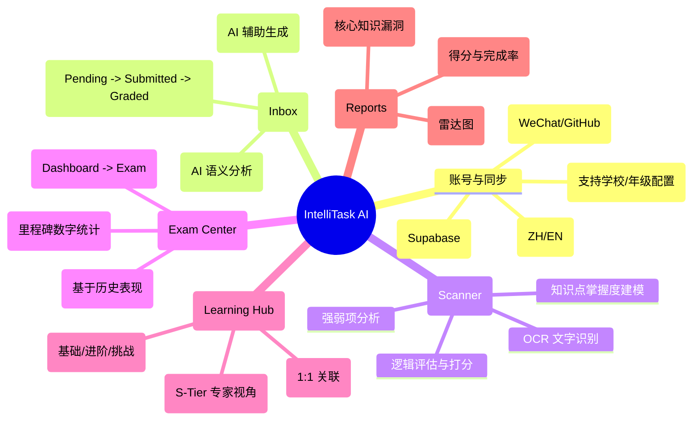
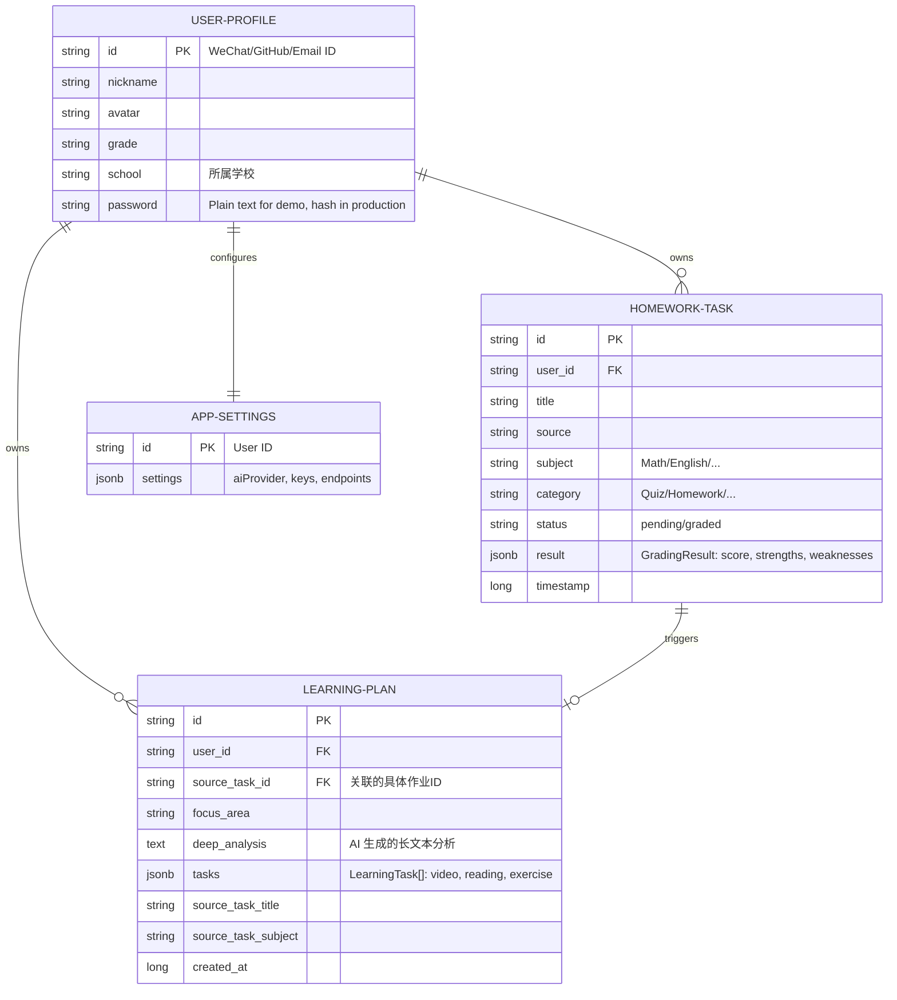

# IntelliTask AI - 智能作业管理系统

IntelliTask AI 是一个闭环的智能教育辅助系统，通过 AI 技术实现从作业采集、批改到自适应学习与报告生成的全流程自动化。

## 1. 业务逻辑分析

系统构建了一个“采集-批改-反馈-提升”的教育闭环，并集成了学术里程碑管理：



## 2. 数据结构 (E-R 图)

系统核心采用以“用户”为中心，通过 `source_task_id` 强关联“学习计划”的关系模型：



## 3. 数据库初始化与迁移 (SQL)

### 3.1 完整初始化脚本 (针对新环境)
在 Supabase **SQL Editor** 中运行以下脚本以创建所有必要的表：

```sql
-- 1. 用户资料表 (增加学校字段)
CREATE TABLE IF NOT EXISTS user_profiles (
  id TEXT PRIMARY KEY,
  nickname TEXT,
  avatar TEXT,
  grade TEXT,
  school TEXT,
  password TEXT
);

-- 2. 作业任务表
CREATE TABLE IF NOT EXISTS homework_tasks (
  id TEXT PRIMARY KEY,
  user_id TEXT REFERENCES user_profiles(id) ON DELETE CASCADE,
  source TEXT,
  subject TEXT,
  category TEXT,
  content TEXT,
  deadline TEXT,
  status TEXT,
  title TEXT,
  timestamp BIGINT,
  submission_image TEXT,
  result JSONB
);

-- 3. 学习计划表
CREATE TABLE IF NOT EXISTS learning_plans (
  id TEXT PRIMARY KEY,
  user_id TEXT REFERENCES user_profiles(id) ON DELETE CASCADE,
  source_task_id TEXT,
  focus_area TEXT,
  tasks JSONB,
  deep_analysis TEXT,
  source_task_title TEXT,
  source_task_subject TEXT,
  created_at BIGINT
);

-- 4. 应用设置表
CREATE TABLE IF NOT EXISTS app_settings (
  id TEXT PRIMARY KEY REFERENCES user_profiles(id) ON DELETE CASCADE,
  settings JSONB NOT NULL,
  updated_at BIGINT
);
```

### 3.2 结构变更脚本 (针对已有环境)
如果您的数据库已经运行，请执行以下命令来同步最新的字段变更：

```sql
-- 为用户表添加学校信息字段
ALTER TABLE user_profiles ADD COLUMN IF NOT EXISTS school TEXT;

-- 确保学习计划表包含关联作业的元数据（用于 Hub 展示）
ALTER TABLE learning_plans ADD COLUMN IF NOT EXISTS source_task_title TEXT;
ALTER TABLE learning_plans ADD COLUMN IF NOT EXISTS source_task_subject TEXT;

-- 禁用 RLS 以确保开发环境顺畅 (仅限开发阶段)
ALTER TABLE user_profiles DISABLE ROW LEVEL SECURITY;
ALTER TABLE homework_tasks DISABLE ROW LEVEL SECURITY;
ALTER TABLE learning_plans DISABLE ROW LEVEL SECURITY;
ALTER TABLE app_settings DISABLE ROW LEVEL SECURITY;
```

## 4. 核心功能说明

### 4.1 学术里程碑与备考中心联动
*   **仪表盘 (Dashboard)**：动态展示学术里程碑（课后作业、周测、月考等），并实时统计各分类下的任务数量。
*   **交互逻辑**：点击仪表盘上的里程碑图标将直接携带状态跳转至 **备考中心 (Exam Center)**，系统会自动定位并高亮目标事件。
*   **AI 备考建议**：系统会分析该里程碑前一阶段的所有作业表现，生成针对性的复习策略。

### 4.2 智能批改与闭环学习
*   **Scanner**：通过 Gemini 1.5 Pro 对上传的作业图片进行 OCR 识别、逻辑批改并给出多维度的知识点掌握评价。
*   **Learning Hub**：根据批改结果中的 Weaknesses 字段，AI 会自动编写深度学情诊断，并提供“基础-进阶-挑战”三段式学习任务。

---
*Powered by Google Gemini API & Supabase.*
