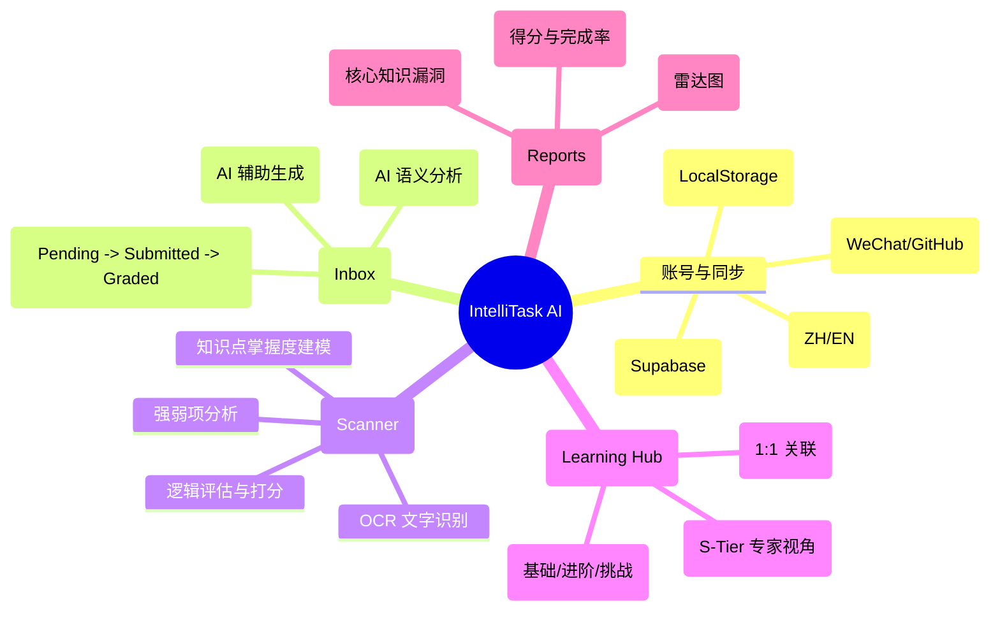
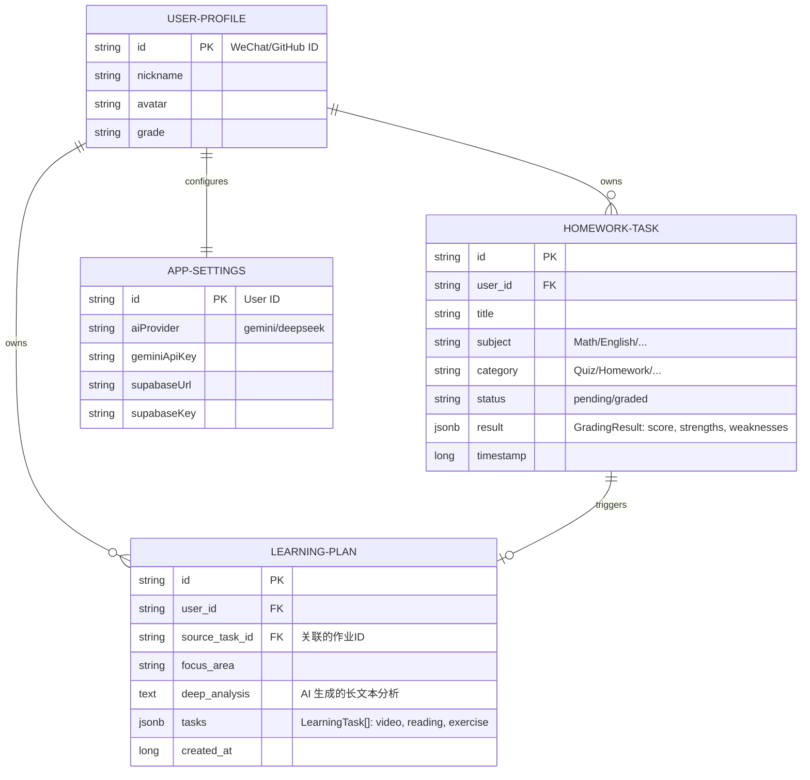

# IntelliTask AI - 智能作业管理系统

IntelliTask AI 是一个闭环的智能教育辅助系统，通过 AI 技术实现从作业采集、批改到自适应学习与报告生成的全流程自动化。

## 1. 业务逻辑分析

系统构建了一个“采集-批改-反馈-提升”的教育闭环：



## 2. 数据结构 (E-R 图)

系统核心采用以“用户”为中心，通过 `source_task_id` 强关联“学习计划”的关系模型：



## 3. 故障排查 (数据不写入？)

如果你的数据没有出现在 Supabase 表中，请依次检查：

1.  **环境变量**：确保 `.env` 中的 `SUPABASE_URL` 和 `SUPABASE_KEY` 正确无误。
2.  **关闭 RLS** (开发阶段建议)：
    在 Supabase SQL Editor 执行以下命令，否则数据库会拦截所有未经认证的写入：
    ```sql
    ALTER TABLE user_profiles DISABLE ROW LEVEL SECURITY;
    ALTER TABLE homework_tasks DISABLE ROW LEVEL SECURITY;
    ALTER TABLE learning_plans DISABLE ROW LEVEL SECURITY;
    ALTER TABLE app_settings DISABLE ROW LEVEL SECURITY;
    ```
3.  **检查控制台**：打开浏览器开发者工具 (F12) -> Console。代码会详细打印 Supabase 返回的报错信息。

## 4. Supabase 数据库结构初始化

在 Supabase **SQL Editor** 中运行以下脚本：

```sql
-- 1. 用户资料
CREATE TABLE IF NOT EXISTS user_profiles (
  id TEXT PRIMARY KEY,
  nickname TEXT,
  avatar TEXT,
  grade TEXT
);

-- 2. 作业任务
CREATE TABLE IF NOT EXISTS homework_tasks (
  id TEXT PRIMARY KEY,
  user_id TEXT REFERENCES user_profiles(id) ON DELETE CASCADE,
  source TEXT,
  subject TEXT,
  category TEXT,
  content TEXT,
  deadline TEXT,
  status TEXT,
  title TEXT,
  timestamp BIGINT,
  submission_image TEXT,
  result JSONB
);

-- 3. 学习计划
CREATE TABLE IF NOT EXISTS learning_plans (
  id TEXT PRIMARY KEY,
  user_id TEXT REFERENCES user_profiles(id) ON DELETE CASCADE,
  source_task_id TEXT, -- 关联的具体作业 ID
  focus_area TEXT,
  tasks JSONB,
  deep_analysis TEXT, -- 存储深度分析文本
  source_task_title TEXT,
  source_task_subject TEXT,
  created_at BIGINT
);

-- 4. 应用设置 (用于持久化 AI 服务商, API 密钥等)
CREATE TABLE IF NOT EXISTS app_settings (
  id TEXT PRIMARY KEY REFERENCES user_profiles(id) ON DELETE CASCADE,
  settings JSONB NOT NULL,
  updated_at BIGINT
);
```